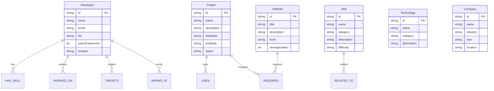

# DevGraph

A developer skill, project, and career recommendation platform powered by CognoDB graph database.

## Why a Graph Database?

DevGraph models developers, skills, projects, technologies, job roles, and companies as interconnected entities. The core questions this application answers are inherently about **connections and relationships**:

- "Which projects is this developer best suited for?" — requires traversing `Developer → Skill → Project`
- "What skills am I missing for a target role?" — requires traversing `Developer → JobRole → Skill` and comparing against `Developer → Skill`
- "Show me the path from a developer to a technology through shared skills" — a multi-hop traversal across 4 node types

**Why not a relational database?**

A relational schema would require multiple join tables (`developer_skills`, `project_skills`, `job_role_skills`, `skill_relations`, etc.) and complex SQL queries with multiple self-joins. The skill gap analysis alone would need recursive CTEs to traverse the `Skill → RELATED_TO` hierarchy. In a graph database, these traversals are first-class operations — a 3-hop query like `Developer -[:HAS_SKILL]-> Skill <-[:REQUIRES]- Project -[:USES]-> Technology` is a single, readable Cypher pattern that executes in constant time per hop, regardless of total dataset size.

Graph databases excel when the **structure of relationships carries meaning**. In DevGraph, the same skill can appear in multiple contexts (a developer has it, a project requires it, a job role demands it), and the connections between skills form their own network. This is naturally represented as a graph, not as rows in flat tables.

## Data Model



### Relationship Summary

| Relationship | Description |
|---|---|
| `Developer -[:HAS_SKILL]-> Skill` | Developer possesses a skill |
| `Developer -[:WORKED_ON]-> Project` | Developer contributed to a project |
| `Project -[:USES]-> Technology` | Project uses a technology |
| `Project -[:REQUIRES]-> Skill` | Project requires a skill |
| `Developer -[:TARGETS]-> JobRole` | Developer is targeting a job role |
| `JobRole -[:REQUIRES]-> Skill` | Job role requires a skill |
| `Developer -[:WORKS_AT]-> Company` | Developer works at a company |
| `Skill -[:RELATED_TO]-> Skill` | Skills are semantically related |

## Project Structure

```
DevGraph/
├── backend/              # Express.js REST API
│   ├── src/
│   │   ├── config/       # Environment configuration
│   │   ├── controllers/  # Request handlers
│   │   ├── cypher/       # Cypher query definitions
│   │   ├── database/     # CognoDB connection, seed, verify
│   │   ├── middleware/    # Error handling, health checks
│   │   ├── routes/       # API route definitions
│   │   ├── services/     # Business logic
│   │   └── types/        # TypeScript interfaces
│   └── .env.example      # Environment variable template
├── frontend/             # Next.js web application
│   ├── src/
│   │   ├── app/          # Next.js App Router pages
│   │   ├── components/   # Reusable UI components
│   │   └── lib/          # API client, types, utilities
│   └── .env.local        # Frontend environment config
├── cypher/               # Graph model documentation
└── README.md             # This file
```

## Getting Started

### Prerequisites

- Node.js (v18 or higher)
- A CognoDB Cloud instance ([sign up free](https://console.cognodb.com/signup))

### 1. Set Up CognoDB

1. Create a free account at [console.cognodb.com](https://console.cognodb.com/signup)
2. Create a free (c0) instance and select a region
3. Copy your connection URI (`bolt+s://...`) and password — the password is shown only once

### 2. Backend Setup

```bash
cd backend
npm install
cp .env.example .env
```

Edit `.env` with your CognoDB credentials:

```
COGNODB_URI=bolt+s://your-instance.databases.cognodb.com:7687
COGNODB_USERNAME=cognodb
COGNODB_PASSWORD=your_password_here
PORT=5000
```

Seed the database with realistic data:

```bash
npm run seed
```

Start the backend server:

```bash
npm run dev
```

The API runs at `http://localhost:5000`.

### 3. Frontend Setup

```bash
cd frontend
npm install
```

The frontend connects to the backend via `NEXT_PUBLIC_API_URL`. For local development:

```bash
# frontend/.env.local
NEXT_PUBLIC_API_URL=http://localhost:5000
```

Start the frontend development server:

```bash
npm run dev
```

The application runs at `http://localhost:3000`.

## API Endpoints

| Method | Endpoint | Description |
|---|---|---|
| GET | `/health` | Health check |
| GET | `/api/developers` | List all developers (optional `?q=` search) |
| GET | `/api/developers/:id` | Developer detail with skills, projects, roles |
| GET | `/api/developers/:id/skills` | Developer's skills |
| GET | `/api/developers/:id/projects` | Developer's projects |
| GET | `/api/developers/:id/recommendations` | Project recommendations |
| GET | `/api/developers/:id/skill-gap/:roleId` | Skill gap for a target role |
| GET | `/api/skills` | List all skills (optional `?q=` search) |
| GET | `/api/skills/:id` | Skill detail |
| GET | `/api/skills/:id/related` | Related skills |
| GET | `/api/projects` | List all projects (optional `?q=` search) |
| GET | `/api/projects/:id` | Project detail |
| GET | `/api/roles` | List all job roles (optional `?q=` search) |
| GET | `/api/roles/:id` | Job role detail |
| GET | `/api/roles/:id/skills` | Skills required by a role |
| GET | `/api/recommendations/developer/:id/multi-hop` | Multi-hop graph traversal |

## Key Queries

### Multi-Hop Traversal (Developer → Skill → Project → Technology)

```cypher
MATCH (d:Developer {id: $developerId})-[:HAS_SKILL]->(s:Skill)
      <-[:REQUIRES]-(p:Project)-[:USES]->(t:Technology)
RETURN p.name AS projectName, collect(DISTINCT s.name) AS matchingSkills,
       collect(DISTINCT t.name) AS technologies
```

### Skill Gap Analysis

```cypher
MATCH (d:Developer {id: $developerId})-[:TARGETS]->(r:JobRole {id: $roleId})-[:REQUIRES]->(req:Skill)
OPTIONAL MATCH (d)-[:HAS_SKILL]->(current:Skill)
WHERE current.id = req.id
WITH req, current IS NULL AS missing
WHERE missing = true
RETURN req.id AS skillId, req.name AS skillName, req.category AS skillCategory
```

## Seed Data

The seed script populates the graph with:

- **18 developers** with realistic profiles, bios, and experience levels
- **18 skills** across categories (Frontend, Backend, Database, DevOps, Mobile, AI/ML)
- **13 technologies** (React, Node.js, PostgreSQL, Docker, Kubernetes, etc.)
- **12 projects** with descriptions and statuses
- **6 job roles** (Junior to Principal level) with salary ranges
- **5 companies** across different industries
- **217 relationships** connecting all entities

## License

MIT
